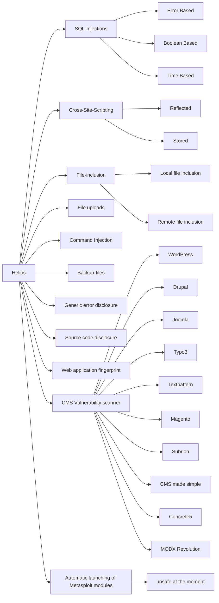
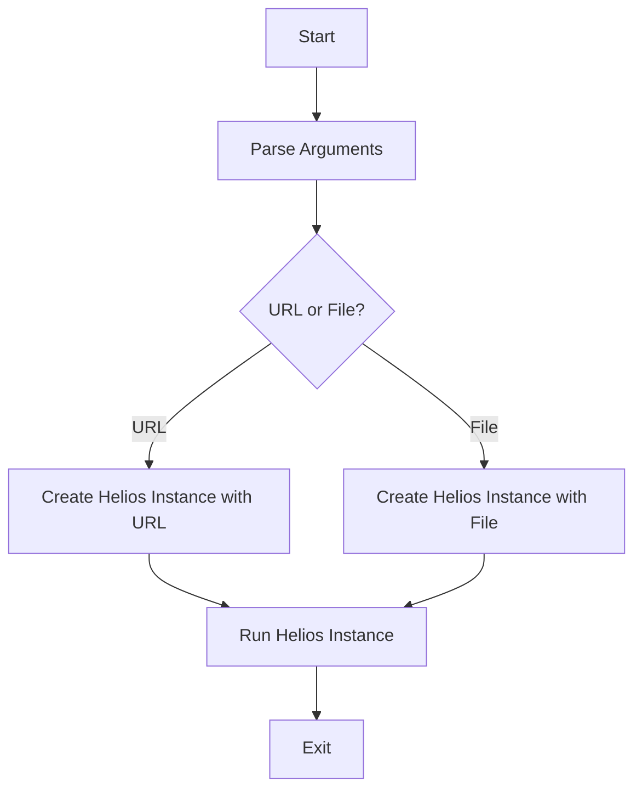
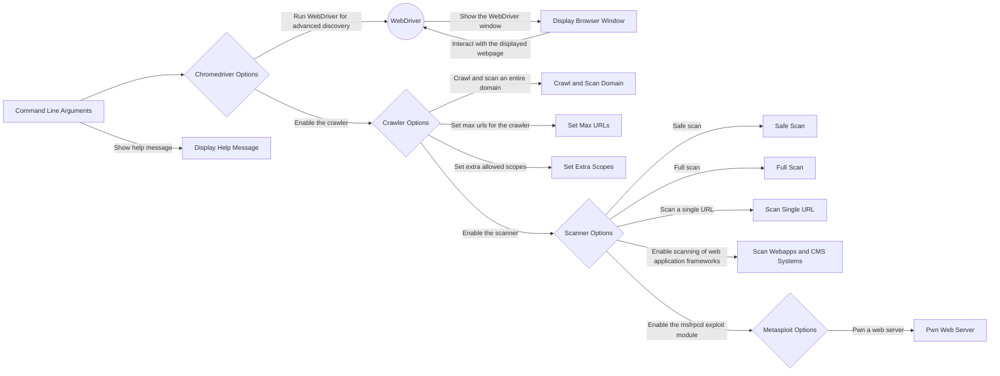

# Helios

Helios is a multi-threaded open-source web application security scanner that can detect various vulnerabilities in web applications. The current version can detect the following vulnerabilities:



## Functioning of new version



## How Helios works?


## Installation

To install Helios, download the repository and run the following command:
```
   cd helios-patched
   pip install . 
```

## Usage

You can use Helios through the command line. There are four types of scans available:

1.  "1" - Crawl and scan an entire domain
2.  "2" - Safe scan
3.  "3" - Full scan
4.  "4" - Scan a single URL

Here is an example of how to run a safe scan:


    import helios from helios.run 
    import run
    run("www.example.com","2")

## Credits


The original author of Helios is Stefan Vlems. The project is licensed under the Apache 2.0 license.

 - [PROJECT LINK](https://github.com/stefan2200/Helios) 
 - [GITHUB USER](https://github.com/stefan2200)

## Modified Package

 - Files changed by @Pranav0-0Aggarwal
 - Documented by @juhiechandra
 - Mentored by @adeyosemanputra

